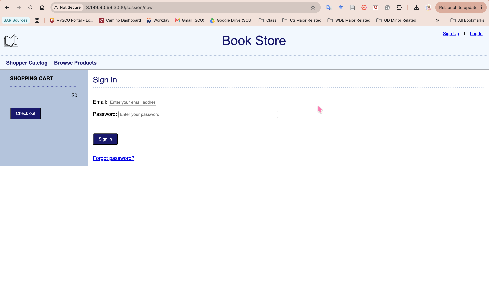
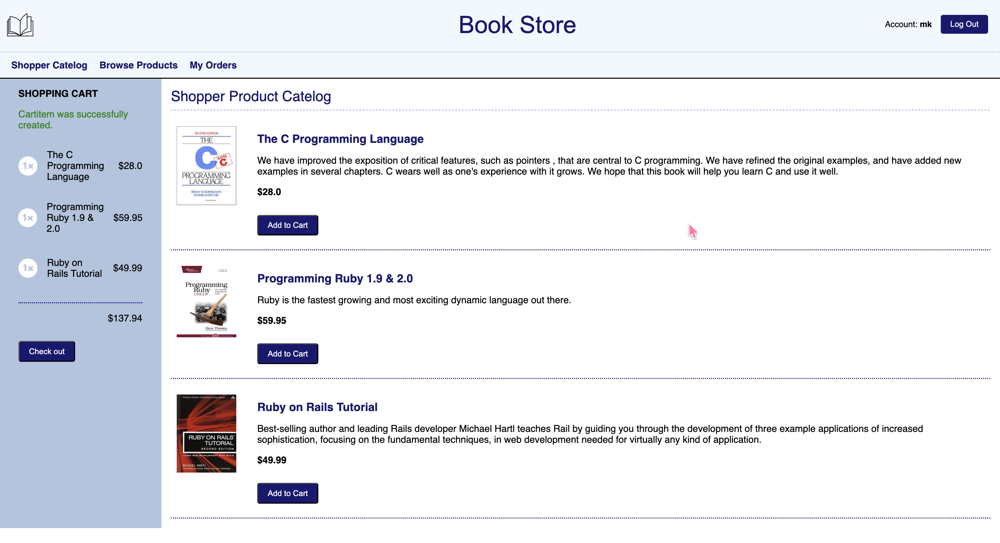
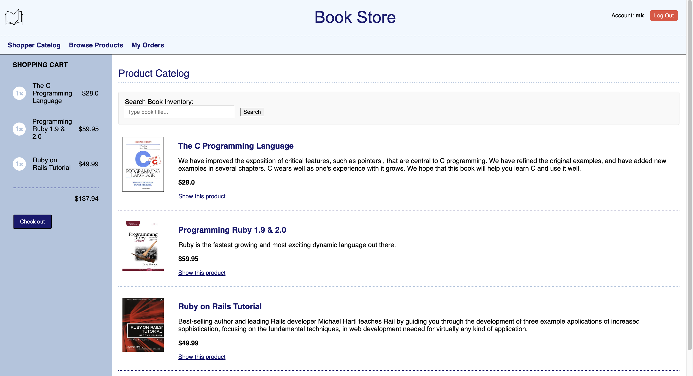
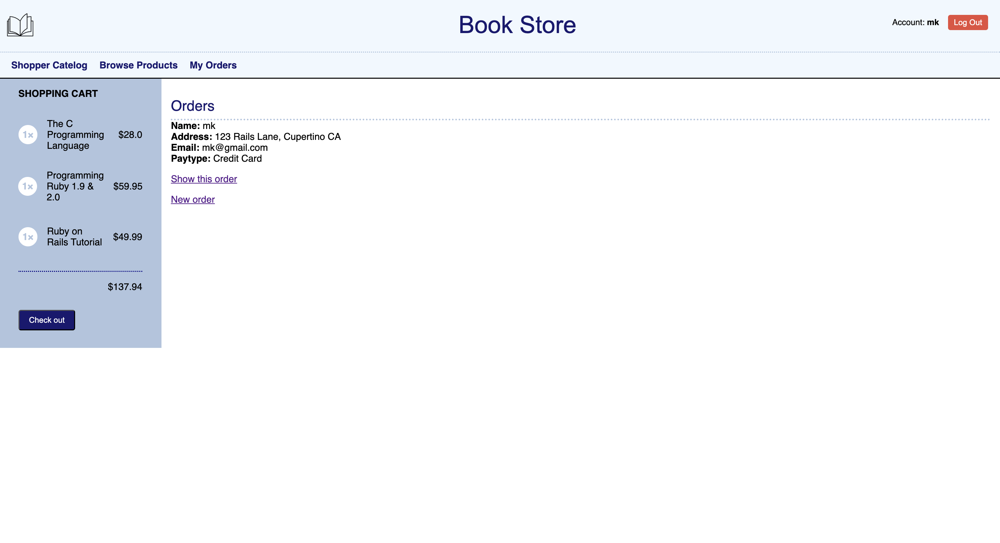

# Bookstore Web App
 CSEN 164 (Advanced Web Development) Final Project (Option A: Online Store Extension, Feature 1: Product Reviews)

 Megu Kanzawa

## Project Title: Bookstore Web App

## Description

A book online store extension, where you are able to simulate a fully functional online bookstore where guest visitors can seamlessly search and browse available titles. 

Once authenticated, users gain access to a personal shopping system, persistent cart states, isolated checkout histories, and an interactive product review system.

## Main Features

1. Extended E-Commerce Mechanics

* Integrated "Add to Cart" capability directly inside individual product detail landing screens.

* A global layout interface complete with an adaptive, identity-aware navigation bar tracking state routing rules to ```/products``` and ```/orders```.

2. Rails 8 Custom Authentication

* Zero-dependency secure authentication built atop native Rails sessions, cookie tracking, and ```has_secure_password```.

* Global ```Current.user``` tracking wrappers simplify authorization checks across independent request pathways.

3. User Order Isolation & History

* Orders map directly to user profiles. Logged-in accounts are strictly limited to rendering their own historical transactions.

* Admin accounts bypass tenancy limitations to generate global indexes across all customer orders.

4. Advanced Product Reviews (Rubric Specialization)

* Safe structural routing mapping reviews strictly beneath products.

* The product detail view calls real-time database functions ```(.average(:rating))``` to display dynamic running scores.

* Strict access authorization handlers prevent malicious cross-user update or delete actions.

5. Index Pattern Filters & Queries

* Custom search form tracking utilizing SQL ```LIKE``` protocols to let users scan inventory by title.

## Model Architecture

```
┌─────────┐             ┌─────────┐             ┌─────────────┐
│  User   │──has_many──>│  Order  │──has_many──>│  CartItem   │
└─────────┘             └─────────┘             └─────────────┘
    │                                                 ▲
    has_many                                       belongs_to
    │                                                 │
    ▼                                          ┌─────────────┐
┌─────────┐                                    │   Product   │
│ Review  │<──belongs_to/has_many──────────────└─────────────┘
└─────────┘

```

* User
    * has_many :orders
    * has_many :reviews
    * Validates identity string matching and profile uniqueness constraints.

* Product
    * has_many :reviews
    * has_many :cartitems

* Review
    * belongs_to :user
    * belongs_to :product
    * Validates rating scopes strictly bounded within integer limits 1..5.
    
* Order
    * belongs_to :user
    * Tracks delivery data matching fields for name, address, email, and pay_type.

* Cart & CartItem
    * Tracks volatile session storage configurations across product groupings.

## How to run the app

1. Clone and install dependencies

```bash
bundle install
```

2. Initialize the Database and Schema Strategy
```bash
rails db:migrate
```

3. Inject Core Grade Sample Records
```bash
rails db:seed
```

4. Fire Up the Web Server
```bash
rails server
```

## How to login as a sample user or admin

The database initialization engine builds two specific user accounts out of the box to test order protection scopes and comment permissions:

* Profile #1 (mk@gmail.com)
    * Username / ID: mk@gmail.com
    * Password String: password123
    * Associated Records Loaded:
        * 1 Product Review: Rating: 5/5 — "very insightful! haha"
        * 1 Shipping Order destination tracking to Cupertino, CA.
* Profile #2 (mk2@gmail.com)
    * Username / ID: mk2@gmail.com
    * Password String: password123
    * Associated Records Loaded:
        * 1 Product Review: Rating: 1/5 — "not very helpful for my course."
        * 1 Shipping Order destination tracking to San Jose, CA.
* Profile Admin (admin@gmail.com)
    * Username / ID: admin@gmail.com
    * Password String: admin
    * Orders for Profile 1 and Profile 2 should be visible

## Screenshots

AWS Hosted Screenshot:


Shopper Catelog:


Product Catelog:


My Orders:


## Known Limitations

* Case Sensitivity Match Scope: Basic SQL ```LIKE``` filtering strings track strict dictionary casing rules depending on the host OS platform environment configuration. Use downstream .downcase converters if testing across mixed character bounds.


